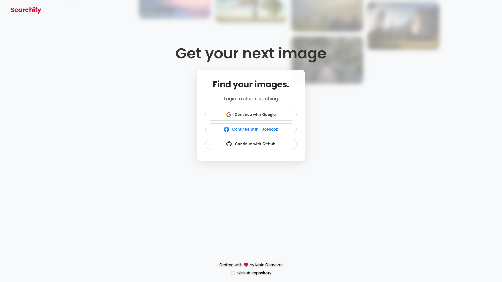

# Searchify 📸

Searchify is a full-stack MERN application that allows users to search for high-quality images from Unsplash, view their personal search history, and see what's trending. This project features a complete OAuth 2.0 authentication system (Google, Facebook, GitHub) and a professional, component-based React frontend.

-----

## ✨ Features Showcase

| Landing Page | Main Search Page |
| :---: | :---: |
|  |  |
| **Hamburger Sidebar** | **User History Page** |
|  |  |
| **Delete History** | **Trending Searches** |
|  |  |
| **Selection Bar** | **Fullscreen View** |
|  |  |
| **Clickable Profile** | **Load More Results** |
|  |  |

## 📋 Core Features

  * **Full OAuth Authentication:** Log in via Google, Facebook, or GitHub using Passport.js.
  * **Dynamic Image Search:** Fetches and displays images from the Unsplash API in a responsive masonry grid.
  * **Dedicated History Page:** A separate, paginated view for users to see their past search terms and timestamps.
  * **Delete History:** Users can select and delete one or more items from their search history.
  * **Trending Searches:** A live-polling banner on the main page shows the top 5 most-searched terms across all users.
  * **Modern UI/UX:**
      * Component-based React architecture (refactored from a single `App.js`).
      * Slide-out hamburger menu for easy navigation.
      * Contextual selection bar appears when selecting images.
      * Loading skeletons and "Empty State" messages for a responsive feel.
      * Clickable profile picture and search images open in a full-screen viewer.

-----

## 🛠️ Tech Stack

**Frontend:**

  * **React.js (v18+)** (with Hooks)
  * **Axios** (for API requests)
  * **CSS3** (for all custom styling, animations, and responsive layout)

**Backend:**

  * **Node.js**
  * **Express.js**
  * **MongoDB** (with **Mongoose** for data modeling)
  * **Passport.js** (for OAuth 2.0)
      * `passport-google-oauth20`
      * `passport-facebook`
      * `passport-github2`
  * **Express Session** (for managing user sessions)
  * **CORS**

-----

## 📁 Folder Structure

The project uses a standard monorepo structure with two main folders, `client` and `server`.

```
/Searchify
│
├── /screenshots    (Contains all project screenshots for README)
│
├── /client           (React Frontend)
│   ├── /public       (Static assets, public/index.html shell)
│   ├── /src
│   │   ├── /components (Reusable UI pieces: Navbar.jsx, ImageGrid.jsx, etc.)
│   │   ├── /pages      (Main "views": LandingPage.jsx, MainPage.jsx, etc.)
│   │   ├── App.js      (Main app container, holds state and logic)
│   │   ├── App.css     (Global stylesheet)
│   │   └── index.js    (React entry point)
│   └── package.json    (Frontend dependencies)
│
├── /server           (Node.js/Express Backend)
│   ├── /middleware   (Authentication middleware: authenticate.js)
│   ├── /models       (Mongoose schemas: User.js, Search.js)
│   ├── /routes       (API endpoints: auth.js, api.js)
│   ├── /services     (Passport.js configuration)
│   ├── .env          (Environment variables - SECRET)
│   ├── index.js      (Backend entry point)
│   └── package.json    (Backend dependencies)
│
└── README.md         (You are here)
```

-----

## 🚀 Getting Started

Follow these instructions to get the project running locally.

### Prerequisites

  * Node.js (v14 or later)
  * `npm`
  * A local or remote MongoDB database

### 1\. Set Up the Backend (Server)

1.  **Clone the repository:**

    ```sh
    git clone https://github.com/Chavhanmoin/Searchify.git
    cd Searchify/server
    ```

2.  **Install server dependencies:**

    ```sh
    npm install
    ```

3.  **Create your environment file:**
    Create a file named `.env` in the `/server` directory and add the following variables.

    **You must get your own API keys** from Google Cloud Console, Facebook for Developers, GitHub OAuth Apps, and Unsplash.

    ```env
    # Server Configuration
    PORT=5000
    CLIENT_ORIGIN=http://localhost:3000
    # Database
    MONGO_URI=your_mongodb_connection_string

    # APIs
    UNSPLASH_ACCESS_KEY=your_unsplash_access_key
    UNSPLASH_SECRET_KEY=your_unsplash_secret_key
    # Google OAuth
    GOOGLE_CLIENT_ID=your_google_client_id
    GOOGLE_CLIENT_SECRET=your_google_client_secret

    # Facebook OAuth
    FACEBOOK_CLIENT_ID=your_facebook_client_id
    FACEBOOK_CLIENT_SECRET=your_facebook_client_secret

    # GitHub OAuth
    GITHUB_CLIENT_ID=your_github_client_id
    GITHUB_CLIENT_SECRET=your_github_client_secret
    ```

4.  **Run the server:**

    ```sh
    npm run dev
    ```

    The server will be running on `http://localhost:5000`.

### 2\. Set Up the Frontend (Client)

1.  Open a new terminal and navigate to the `/client` directory:

    ```sh
    cd ../client
    ```

2.  **Install client dependencies:**

    ```sh
    npm install
    ```

3.  **Run the client:**

    ```sh
    npm start
    ```

    The React app will open and run on `http://localhost:3000`.

### 3\. Configure OAuth Callbacks

In your Google, GitHub, and Facebook developer dashboards, you must whitelist your callback URLs.

  * **Authorized JavaScript origins:** `http://localhost:3000`
  * **Authorized redirect URIs:**
      * `http://localhost:5000/auth/google/callback`
      * `http://localhost:5000/auth/github/callback`
      * `http://localhost:5F000/auth/facebook/callback`

-----

## 🔌 API Endpoint Examples

Here are cURL examples for testing the backend API. Note that **protected routes** (`/api/search`, `/api/history`) require you to be authenticated. The easiest way to test these is to log in through the browser first, which will create a session cookie that cURL can then use.

### Authentication Routes

These routes are meant to be opened in a browser.

```sh
# Initiates Google OAuth login
# Open this URL in your browser
http://localhost:5000/auth/google

# Initiates GitHub OAuth login
# Open this URL in your browser
http://localhost:5000/auth/github

# Checks if a user is currently logged in (returns user JSON)
curl http://localhost:5000/auth/success

# Logs the user out
curl http://localhost:5000/auth/logout
```

### Application API Routes

```sh
# GET: Top 5 most-searched terms
# (Publicly available)
curl http://localhost:5000/api/top-searches

# POST: Search for images (Protected)
# (Requires auth cookie)
curl -X POST http://localhost:5000/api/search \
     -H "Content-Type: application/json" \
     --cookie "connect.sid=your_session_cookie_here" \
     -d '{"term":"nature", "page":1}'

# GET: Get the user's search history (Protected)
# (Requires auth cookie)
curl http://localhost:5000/api/history?page=1&limit=5 \
     --cookie "connect.sid=your_session_cookie_here"

# DELETE: Delete items from history (Protected)
# (Requires auth cookie)
curl -X DELETE http://localhost:5SO00/api/history \
     -H "Content-Type: application/json" \
     --cookie "connect.sid=your_session_cookie_here" \
     -d '{"ids":["65410a56e7f13f0896dfa2c8", "65410a50e7f13f0896dfa2c5"]}'
```

-----

Crafted with ❤️ by **Moin Chavhan**